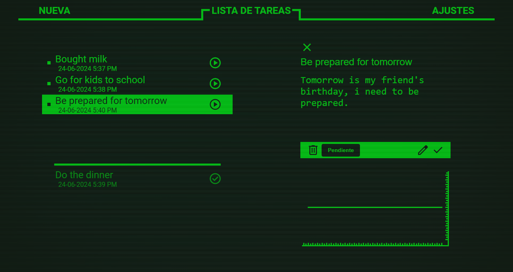

# Pip-Task

This project is based entirely on ***HTML - CSS - JAVASCRIPT.***

## About 
This project aims to create a task generator where you can perform basic CRUD operations using the MoakApi.com API. Additionally, it integrates the [*Speakit-JS*](https://github.com/mobilepadawan/Speakit-JS/?tab=readme-ov-file#how-to-use-it) library, allowing you to listen your task descriptions.

## objectives

1. Create a task generator with which you can perform basic CRUD operations using MoakApi.
2. Develop an interface inspired by Fallout's Pip-Boy.

## Author 
Me - 💪😎
LinkEdin - [/in/mariano-joel-migueles/](https://www.linkedin.com/in/mariano-joel-migueles/)
